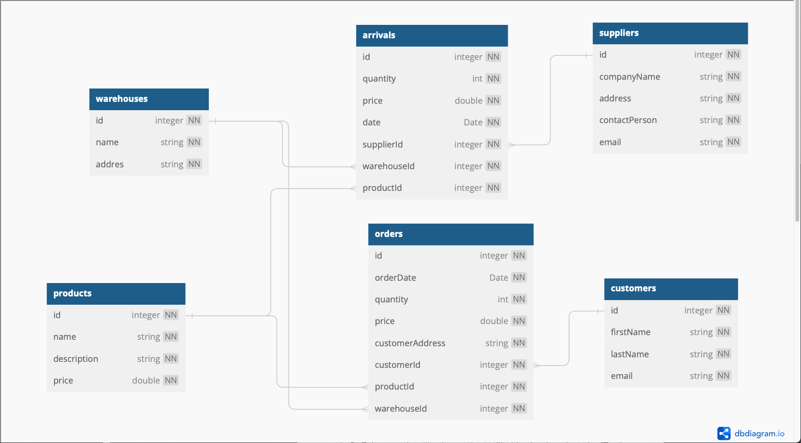

### Условие
Реализовать библиотеку классов, для эмуляции базы данных
склада. Реализовать классы «Склад», «Товар», «Покупатель», «По-
ставщик».
Должны быть реализованы следующие функции:
1. добавление единицы товара;
2. отпуск товара покупателю;
3. получение информации о доступных позициях товара;
4. получение информации о наличии товара на складе;
5. группировка товаров по видам;
6. получение информации по поставщикам;
7. получение информации по покупателям.

### ER диаграмма
